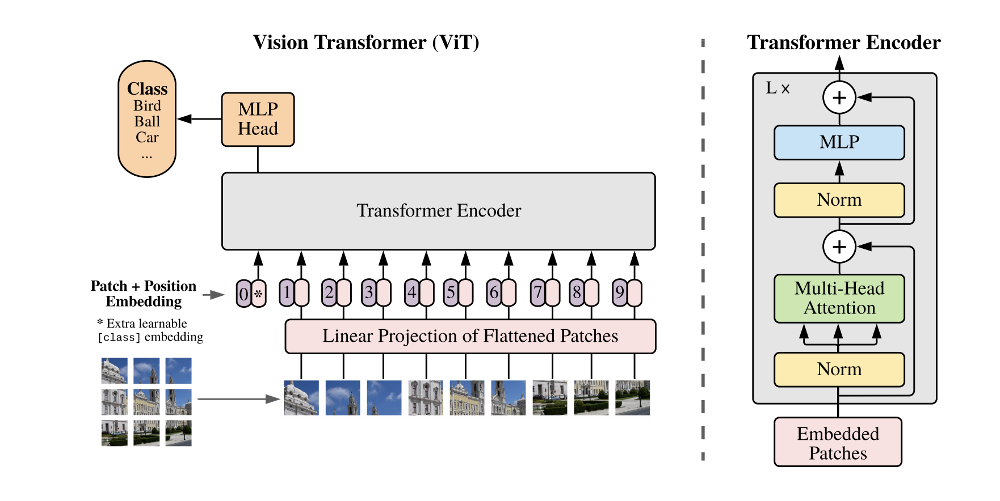

# Vision-Transformer👁️
[](https://nakshatrasinghh-io.vercel.app/) [](https://github.com/nakshatrasinghh/Vision-Transformer/blob/main/LICENSE)

<p align="center">
    
</p>

Tensorflow implementation of the Vision Transformer (ViT) presented in 
[An Image is Worth 16x16 Words: Transformers for Image Recognition at Scale](https://openreview.net/pdf?id=YicbFdNTTy),
where the authors show that Transformers applied directly to image patches and pre-trained on large datasets work really well on image classification.

## Check out my Medium Blog on Vision Transformer 👇


## [Abstract](https://openreview.net/forum?id=YicbFdNTTy)
Abstract: While the Transformer architecture has become the de-facto standard for natural language processing tasks, its applications to computer vision remain limited. In vision, attention is either applied in conjunction with convolutional networks, or used to replace certain components of convolutional networks while keeping their overall structure in place. We show that this reliance on CNNs is not necessary and a pure transformer can perform very well on image classification tasks when applied directly to sequences of image patches. When pre-trained on large amounts of data and transferred to multiple recognition benchmarks (ImageNet, CIFAR-100, VTAB, etc), Vision Transformer attains excellent results compared to state-of-the-art convolutional networks while requiring substantially fewer computational resources to train.

Vision Transformer implemented using Tensorflow 2.0 and Einops-0.3.0.

Example Notebook can found in [`cifar10_example.ipynb`](https://github.com/nakshatrasinghh/Vision-Transformer/blob/main/cifar10_example.ipynb)

## Run Notebook in Colab 👇

[](https://colab.research.google.com/github/nakshatrasinghh/Vision-Transformer/blob/main/cifar10_example.ipynb)

## Citations

```bibtex
@inproceedings{
    anonymous2021an,
    title={An Image is Worth 16x16 Words: Transformers for Image Recognition at Scale},
    author={Anonymous},
    booktitle={Submitted to International Conference on Learning Representations},
    year={2021},
    url={https://openreview.net/forum?id=YicbFdNTTy},
    note={under review}
}
```
